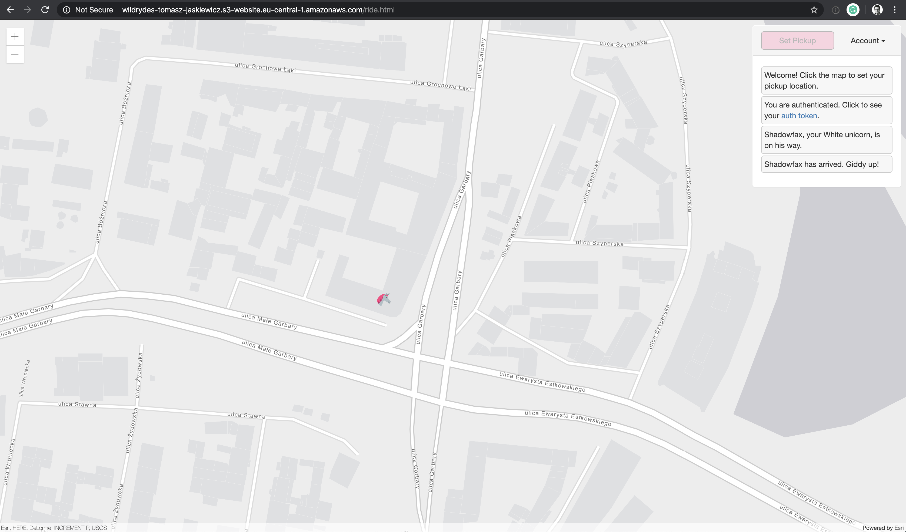

# team-delta hackathon

## AWS

### Build a Serverless Web Application [(link)](https://aws.amazon.com/getting-started/projects/build-serverless-web-app-lambda-apigateway-s3-dynamodb-cognito/)

A simple serverless web application that enables users to request unicorn rides from the Wild Rydes fleet. The application will present users with an HTML based user interface for indicating the location where they would like to be picked up and will interface on the backend with a RESTful web service to submit the request and dispatch a nearby unicorn. The application will also provide facilities for users to register with the service and log in before requesting rides.


#### Module 1. Static Web Hosting

In this module you'll configure Amazon Simple Storage Service (S3) to host the static resources for your web application. In subsequent modules you'll add dynamic functionality to these pages using JavaScript to call remote RESTful APIs built with AWS Lambda and Amazon API Gateway.


##### Create an S3 Bucket

```
wildrydes-tomasz-jaskiewicz
```

##### Upload Content

```bash
aws s3 sync s3://wildrydes-us-east-1/WebApplication/1_StaticWebHosting/website s3://wildrydes-tomasz-jaskiewicz --region eu-central-1
```

##### Add a Bucket Policy to Allow Public Reads

```json
{
    "Version": "2012-10-17",
    "Statement": [
        {
            "Effect": "Allow",
            "Principal": "*",
            "Action": "s3:GetObject",
            "Resource": "arn:aws:s3:::[YOUR_BUCKET_NAME]/*"
        }
    ]
}
```

##### Enable Website Hosting

http://wildrydes-tomasz-jaskiewicz.s3-website.eu-central-1.amazonaws.com

##### Validate your implementation


#### Module 2. User Management

In this module you'll create an Amazon Cognito user pool to manage your users' accounts. You'll deploy pages that enable customers to register as a new user, verify their email address, and sign into the site.


When users visit your website they will first register a new user account. For the purposes of this workshop we'll only require them to provide an email address and password to register. However, you can configure Amazon Cognito to require additional attributes in your own applications.

After users submit their registration, Amazon Cognito will send a confirmation email with a verification code to the address they provided. To confirm their account, users will return to your site and enter their email address and the verification code they received. You can also confirm user accounts using the Amazon Cognito console if want to use fake email addresses for testing.

After users have a confirmed account (either using the email verification process or a manual confirmation through the console), they will be able to sign in. When users sign in, they enter their username (or email) and password. A JavaScript function then communicates with Amazon Cognito, authenticates using the Secure Remote Password protocol (SRP), and receives back a set of JSON Web Tokens (JWT). The JWTs contain claims about the identity of the user and will be used in the next module to authenticate against the RESTful API you build with Amazon API Gateway.

##### Create an Amazon Cognito User Pool

```
Pool Id eu-central-1_swGkkoXZo
```

##### Add an App to Your User Pool

```
App client id 5d06ee32h42toog7ht9n4aq9js
```

##### Update the config.js File in Your Website Bucket

```js
window._config = {
    cognito: {
        userPoolId: 'eu-central-1_swGkkoXZo', // e.g. us-east-2_uXboG5pAb
        userPoolClientId: '5d06ee32h42toog7ht9n4aq9js', // e.g. 25ddkmj4v6hfsfvruhpfi7n4hv
        region: 'eu-central-1' // e.g. us-east-2
    },
    api: {
        invokeUrl: '' // e.g. https://rc7nyt4tql.execute-api.us-west-2.amazonaws.com/prod,
    }
};
```

##### Validate your implementation

auth token:
```
eyJraWQiOiJ6QWRMYzJIdHhJMldhQU1OZDF6d1F2NGsxM3FBUnZSaHpCNHFSWlBRQTM4PSIsImFsZyI6IlJTMjU2In0.eyJzdWIiOiJkZTIxNGQ0ZS0xOTg3LTQ2MTEtOWQ2NS0xNDNmNzUxZGY2NzMiLCJhdWQiOiI1ZDA2ZWUzMmg0MnRvb2c3aHQ5bjRhcTlqcyIsImVtYWlsX3ZlcmlmaWVkIjp0cnVlLCJldmVudF9pZCI6IjcxYzEzZGJmLTk4YWMtNDVkMC05OTA5LTc3YmRkZTVhZjIzOSIsInRva2VuX3VzZSI6ImlkIiwiYXV0aF90aW1lIjoxNTc2MjQ0MTU3LCJpc3MiOiJodHRwczpcL1wvY29nbml0by1pZHAuZXUtY2VudHJhbC0xLmFtYXpvbmF3cy5jb21cL2V1LWNlbnRyYWwtMV9zd0dra29YWm8iLCJjb2duaXRvOnVzZXJuYW1lIjoidG9tYXN6Lmphc2tpZXdpY3otYXQtbmV0Z3VydS5jb20iLCJleHAiOjE1NzYyNDc3NTcsImlhdCI6MTU3NjI0NDE1OCwiZW1haWwiOiJ0b21hc3ouamFza2lld2ljekBuZXRndXJ1LmNvbSJ9.TMorEPldwHsfsoxCFf7BxseLQL_RY90NfAU8sG2oRdQXnjo04xVz7yNtaebDp9TtoLpb0vengwF_A384iykX35G0ZOAI5Rgh-Hv5T1fFGwjYevVqOhujZ9rEOk3CevY1aU_7Tez49MoPUBz9BJGk-4RKt0DytTSwl7XFi-2kDu4QcZ_WTj3mqQ01PD14Mujm6NRS9WM19gxGBvkdPbnEaglOySe9Y0_Ch3fHjndfvNbbYQ2Q-LWubtyhgkJcfSr21d3piO3TVSakxnSYKk9dT8_rs9o-gJQmvIt_hKKJ5DPHaFxabbnqEkPLJFvrs4nj58dBg-1BOI0oTJ5X-CF90w
```


#### Module 3: Serverless Service Backend

In this module you'll use AWS Lambda and Amazon DynamoDB to build a backend process for handling requests for your web application. The browser application that you deployed in the first module allows users to request that a unicorn be sent to a location of their choice. In order to fulfill those requests, the JavaScript running in the browser will need to invoke a service running in the cloud.


You'll implement a Lambda function that will be invoked each time a user requests a unicorn. The function will select a unicorn from the fleet, record the request in a DynamoDB table and then respond to the front-end application with details about the unicorn being dispatched.

The function is invoked from the browser using Amazon API Gateway. You'll implement that connection in the next module. For this module you'll just test your function in isolation.

##### Create an Amazon DynamoDB Table

```
Amazon Resource Name (ARN)	arn:aws:dynamodb:eu-central-1:836090908321:table/Rides
```

##### Create an IAM Role for Your Lambda function

Every Lambda function has an IAM role associated with it. This role defines what other AWS services the function is allowed to interact with. For the purposes of this workshop, you'll need to create an IAM role that grants your Lambda function permission to write logs to Amazon CloudWatch Logs and access to write items to your DynamoDB table.

```
Role ARN arn:aws:iam::836090908321:role/WildRydesLambda
```

##### Create a Lambda Function for Handling Requests

AWS Lambda will run your code in response to events such as an HTTP request. In this step you'll build the core function that will process API requests from the web application to dispatch a unicorn. In the next module you'll use Amazon API Gateway to create a RESTful API that will expose an HTTP endpoint that can be invoked from your users' browsers. You'll then connect the Lambda function you create in this step to that API in order to create a fully functional backend for your web application.

```
ARN arn:aws:lambda:eu-central-1:836090908321:function:RequestUnicorn
```

##### Validate Your Implementation

```
{
  "statusCode": 201,
  "body": "{\"RideId\":\"xxxxxxxxxxx-gA\",\"Unicorn\":{\"Name\":\"Shadowfax\",\"Color\":\"White\",\"Gender\":\"Male\"},\"UnicornName\":\"Shadowfax\",\"Eta\":\"30 seconds\",\"Rider\":\"the_username\"}",
  "headers": {
    "Access-Control-Allow-Origin": "*"
  }
}
```

#### Module 4. RESTful APIs

In this module you'll use Amazon API Gateway to expose the Lambda function you built in the previous module as a RESTful API. This API will be accessible on the public Internet. It will be secured using the Amazon Cognito user pool you created in the previous module. Using this configuration you will then turn your statically hosted website into a dynamic web application by adding client-side JavaScript that makes AJAX calls to the exposed APIs.


The diagram above shows how the API Gateway component you will build in this module integrates with the existing components you built previously. The grayed out items are pieces you have already implemented in previous steps.

The static website you deployed in the first module already has a page configured to interact with the API you'll build in this module. The page at /ride.html has a simple map-based interface for requesting a unicorn ride. After authenticating using the /signin.html page, your users will be able to select their pickup location by clicking a point on the map and then requesting a ride by choosing the "Request Unicorn" button in the upper right corner.

This module will focus on the steps required to build the cloud components of the API, but if you're interested in how the browser code works that calls this API, you can inspect the ride.js file of the website. In this case the application uses jQuery's ajax() method to make the remote request.

##### Create a New REST API

##### Create a Cognito User Pools Authorizer

##### Create a new resource and method

```
arn:aws:lambda:eu-central-1:836090908321:function:RequestUnicorn
```

##### Deploy Your API

```
Invoke URL: https://6xh9hspsd6.execute-api.eu-central-1.amazonaws.com/prod
```

##### Update the Website Config

##### Validate your implementation




#### Module 5. Resource Cleanup

In this module, you will go through the steps to terminate all the resources you created throughout this tutorial. You will terminate an Amazon S3 bucket, an Amazon Cognito User Pool, an AWS Lambda function, an IAM role, a DynamoDB table, a REST API, and a CloudWatch Log. It is a best practice to delete resources you are no longer using to avoid unwanted charges.

##### Delete your Amazon S3 bucket

##### Delete your Amazon Cognito user pool

##### Delete your serverless backend

##### Delete your REST API

##### Delete your CloudWatch Log

Congratulations, you built and terminated a serverless web application using Amazon Web Services (AWS).

